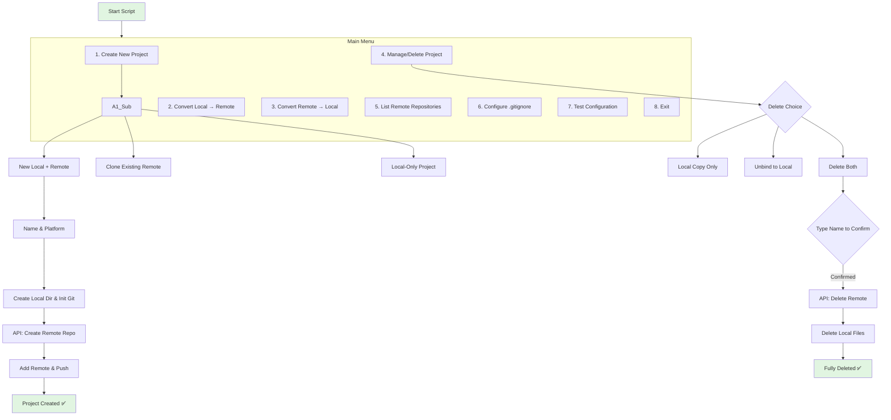
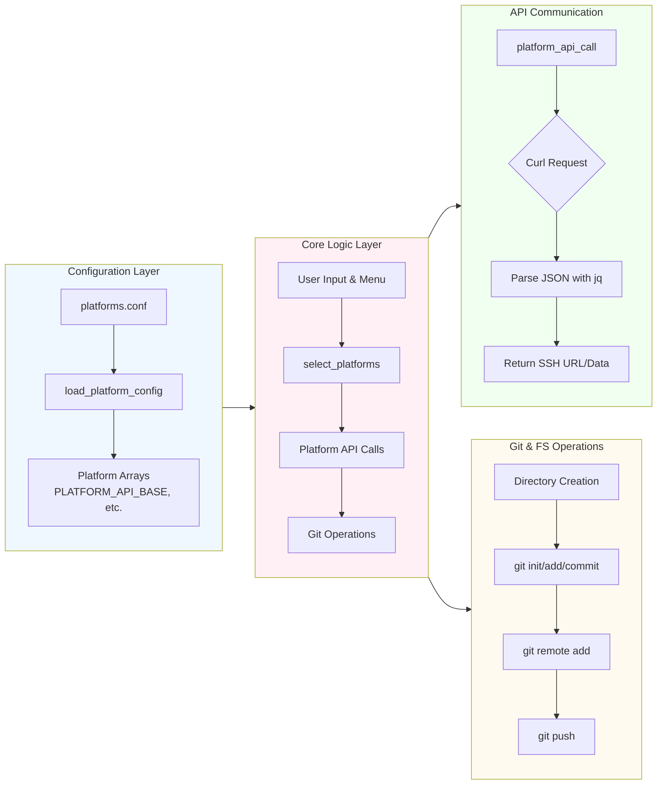
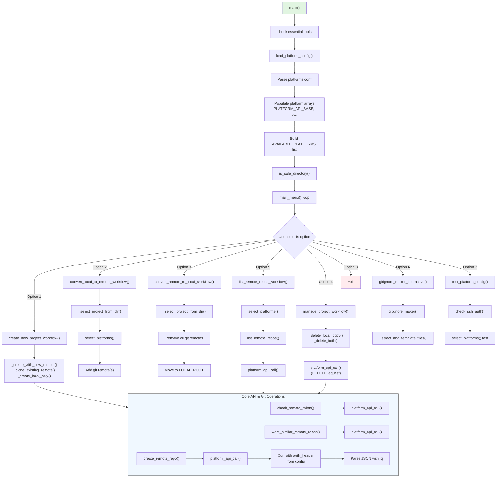

# Interactive-git-helper-shell-script

<strong style="color: #000000;">🛑 Caution</strong> 
Although this code has been reviewed, it has been tailored with AI LLM assistance and some features still require testing, so still under development. The code has to be refactored further. Please review the code thoroughly before use. You can refer to the other documentation files if necessary.

## Navigation flow diagram

## Functional/Processes Flow diagram

## More detailed Functional Diagram

## Issues and Contact
I am not fully available, although you can email me, but I cannot respond immediately, the cycle of improvement and issues would be over a month. For those who are willing to file an issue in GitHub, please file all issues you have in mind instead of separately filling issues for each problem, so that it collect everything exhaustively, and also avoid to file similar issues, Either comment in exisitng issue or leave as is. Thank you for your understanding.

## License

This project uses multiple licenses for different components:

*   **Source Code**: The `repo-crafter.sh` script is licensed under the **GNU General Public License v3.0** (GPLv3).
*   **Technical Documentation**: The file `Code_Documentation.md` is licensed under the **Creative Commons Attribution-ShareAlike 4.0 International License** (CC BY-SA 4.0).
*   **User Guide**: The file `User_Manual.md` is licensed under the **Creative Commons Attribution 4.0 International License** (CC BY 4.0).

For full license texts, please see the `LICENSE.md` file and the notices at the top of each documentation file.
