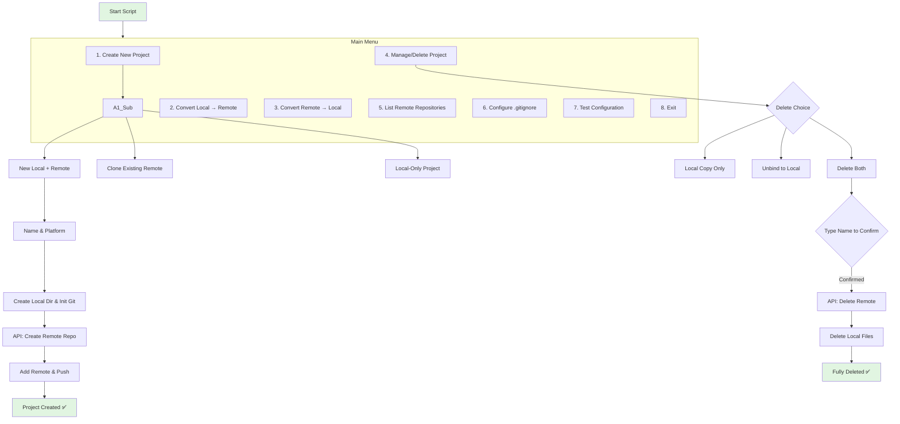
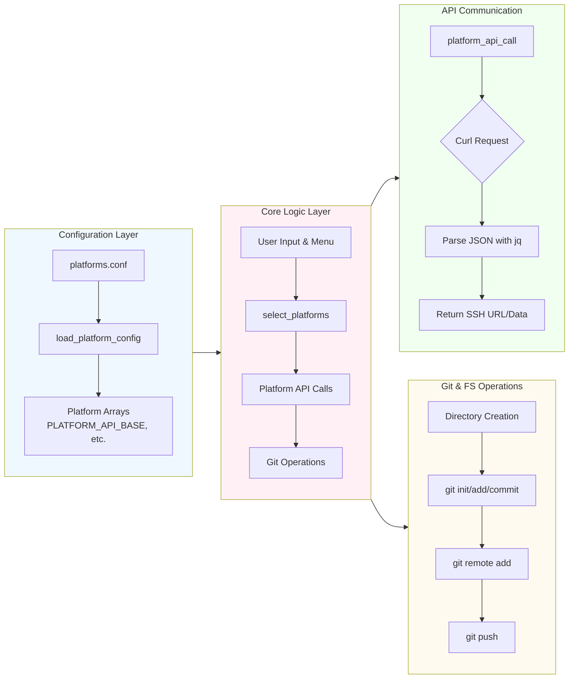

# Interactive-git-helper-shell-script

<div style="background-color: #fff3cd; border-left: 4px solid #ffc107; padding: 12px; margin: 16px 0; border-radius: 4px;">
<strong>Caution</strong><br>
Although code being reviewed, it has been tailored with AI LLM assistance and there are still some features that needs testing. Please review the code before use, You can use other documentations if necessary. 
</div>

## Navigation flow diagram



## Functional/Processes Flow diagram



## More detailed Functional Diagram

```mermaid
flowchart TD
    Start[Script Start] --> MainFunc[main function]
    
    MainFunc --> CheckTools{Check essential tools?}
    CheckTools -->|Yes: git, curl, jq, ssh| LoadConfig[load_platform_config]
    CheckTools -->|No| Error[Exit with error]
    
    LoadConfig --> ParseConfig[Parse platforms.conf]
    ParseConfig --> PopulateArrays[Populate Platform Arrays<br/>e.g., PLATFORM_API_BASE]
    PopulateArrays --> BuildList[Build AVAILABLE_PLATFORMS list]
    BuildList --> ConfigTest{User runs config test?}
    
    ConfigTest -->|Yes via --test flag| TestFlow[test_platform_config]
    ConfigTest -->|No / Continue| SafetyCheck[is_safe_directory]
    SafetyCheck -->|Not Safe| ExitError[Exit: Unsafe directory]
    SafetyCheck -->|Safe| ShowStatus[Show platform token status]
    ShowStatus --> LaunchMenu[main_menu loop]

    LaunchMenu --> UserChoice{User Menu Choice}
    
    UserChoice -->|1| CreateFlow[create_new_project_workflow]
    CreateFlow --> ChooseType{Create Type?}
    ChooseType -->|1. New Local+Remote| _create_with_new_remote
    ChooseType -->|2. Clone Existing| _clone_existing_remote
    ChooseType -->|3. Local Only| _create_local_only
    
    _create_with_new_remote --> Steps1[1. _prompt_project_name]
    Steps1 --> Steps2[2. select_platforms]
    Steps2 --> Steps3[3. warn_duplicate_repo_name]
    Steps3 --> Steps4[4. warn_similar_remote_repos]
    Steps4 --> Steps5[5. _prompt_visibility]
    Steps5 --> Steps6[6. mkdir, git init, README]
    Steps6 --> Steps7[7. gitignore_maker]
    Steps7 --> LoopPlatforms[For each platform:]
    LoopPlatforms --> API_Create[create_remote_repo]
    API_Create --> GenericCall[platform_api_call]
    GenericCall --> CurlExec[Curl with auth header]
    CurlExec --> ParseResp[Parse JSON for SSH URL]
    ParseResp --> AddRemote[git remote add]
    AddRemote --> GitPush[git add, commit, push]
    GitPush --> EndCreate[✅ Project Created]
    
    UserChoice -->|2| BindFlow[convert_local_to_remote_workflow]
    BindFlow --> SelectLocal[_select_project_from_dir]
    SelectLocal --> ChoosePlatforms[select_platforms]
    ChoosePlatforms --> MoveDir[Move dir to REMOTE_ROOT]
    MoveDir --> AddRemotes[Add git remote(s)]
    
    UserChoice -->|3| UnbindFlow[convert_remote_to_local_workflow]
    UnbindFlow --> SelectRemote[_select_project_from_dir]
    SelectRemote --> Confirm[Confirm removal]
    Confirm --> RemoveAllRemotes[Remove all git remotes]
    RemoveAllRemotes --> MoveToLocal[Move dir to LOCAL_ROOT]
    
    UserChoice -->|4| DeleteFlow[manage_project_workflow]
    DeleteFlow --> DeleteChoice{Delete Choice?}
    DeleteChoice -->|1. Local Copy| _delete_local_copy
    DeleteChoice -->|2. Unbind| UnbindFlow
    DeleteChoice -->|3. Both| _delete_both
    _delete_both --> TypeConfirm{Type name to confirm}
    TypeConfirm -->|Confirmed| APIDelete[API call to delete remote]
    APIDelete --> LocalDelete[rm -rf local dir]
    
    UserChoice -->|5| ListFlow[list_remote_repos_workflow]
    ListFlow --> ListPlatforms[select_platforms]
    ListPlatforms --> ForEachList[For each platform]
    ForEachList --> API_List[list_remote_repos]
    API_List --> GenericCall
    
    UserChoice -->|6| GitignoreFlow[gitignore_maker_interactive]
    GitignoreFlow --> _select_and_template_files
    
    UserChoice -->|7| TestFlow
    TestFlow --> TokenCheck[Check token env vars]
    TokenCheck --> SSHCheck[check_ssh_auth]
    SSHCheck --> TestSelect[Test select_platforms]
    
    UserChoice -->|8| ExitScript[Exit 0]
    
    %% Data Flow Highlights
    ParseConfig -.->|Populates| Arrays
    Arrays -.->|Used by| API_Create
    Arrays -.->|Used by| API_List
    
    style Start fill:#e1f5e1
    style ExitScript fill:#ffebee
    style EndCreate fill:#e1f5e1
    style Error fill:#ffebee
    style ExitError fill:#ffebee
    style Arrays fill:#f0f8ff
    style GenericCall fill:#fff0f5
    style CurlExec fill:#f0fff0
```

## License

This project uses multiple licenses for different components:

*   **Source Code**: The `repo-crafter.sh` script is licensed under the **GNU General Public License v3.0** (GPLv3).
*   **Technical Documentation**: The file `Code_Documentation.md` is licensed under the **Creative Commons Attribution-ShareAlike 4.0 International License** (CC BY-SA 4.0).
*   **User Guide**: The file `User_Manual.md` is licensed under the **Creative Commons Attribution 4.0 International License** (CC BY 4.0).

For full license texts, please see the `LICENSE.md` file and the notices at the top of each documentation file.
