# Interactive-git-helper-shell-script

> [!CAUTION]
> Although this code has been reviewed, it has been tailored with AI LLM assistance and some features still require testing, so it is still under development. The code has to be refactored further.
> **Please review the code thoroughly before use.** You can refer to the other documentation files if necessary.

The README.md would be gradually edited and updated.

Documentations you can use;

- Code Documentation : for debugging or easy understanding of script
- User Manual : to understand and ease of use for Interactions with the script.
- Also refer platform.conf for your setup.
- View below diagrams for easy visualization, but there might be mistakes, which will also be resolved gradually.

## Navigation flow diagram

```mermaid
flowchart TD
    Start[Start: repo-crafter.sh] --> Args{Command Line Args?}
    Args -- "--dry-run / -n" --> Dry[DRY-RUN Mode\nPreview Only]
    Args -- "--test / -t" --> Test[Run Tests & Exit]
    Args -- "--help / -h" --> Help[Show Help & Exit]
    Args -- "none" --> MainMenu
    
    Dry --> MainMenu
    
    subgraph MainMenu [Main Menu Loop]
        direction TB
        M1[🆕 Create New Project] --> M1_Sub
        M2[🔗 Convert Local → Remote]
        M3[🔓 Convert Remote → Local]
        M4[🗑️ Manage/Delete Project]
        M5[📋 List Remote Repositories]
        M6[⚙️ Configure .gitignore]
        M7[🧪 Test Configuration]
        M8[ℹ️ About this script]
        M9[🚪 Exit]
    end

    M1_Sub --> C1[Create Local + Remote]
    M1_Sub --> C2[Clone Existing Remote]
    M1_Sub --> C3[Create Local-Only]

```

## Functional/Processes Flow diagram

## Issues and Contact
I am not fully available, although you can email me, but I cannot respond immediately, the cycle of improvement and issues tracking would be over a month. 
For those who are willing to file an issue in GitHub/GitLab, please file all issues collectively you believe about the functioning of script, such as vulnerabilities, bugs, feature-request, etc., instead of separately filling issues for each problem, that is collectively everything exhaustively, and also avoid to file similar issues, Either comment in exisitng issue or leave as is. 
Thank you for your understanding.

## License

This project uses multiple licenses for different components:

*   **Source Code**: The `repo-crafter.sh` script is licensed under the **GNU General Public License v3.0** (GPLv3).
*   **Technical Documentation**: The file `Code_Documentation.md` is licensed under the **Creative Commons Attribution-ShareAlike 4.0 International License** (CC BY-SA 4.0).
*   **User Guide**: The file `User_Manual.md` is licensed under the **Creative Commons Attribution 4.0 International License** (CC BY 4.0).

For full license texts, please see the `LICENSE.md` file and the notices at the top of each documentation file.
